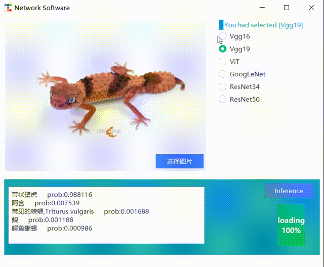

# Image Understanding

This repository is for the class - Image Understanding. [XDU Junior Three].

For this class we have make an little demo for the mainstream Image Classification Network

- GoogLeNet
- ResNet
- VGG
- ViT

## Usage

### requirements
- pytorch
- torchvision
- tqdm
- argparse
- tkinter
- ttkbootstrap

### weights
Before using this project, please download the `pretrained models` and put as followed format:
```
- GoogLeNet
   - weights
- ResNet
   - weights
- VGG
   - weights
- ViT
   - weights
```

### run
```
python show_out.py
```


### Result
